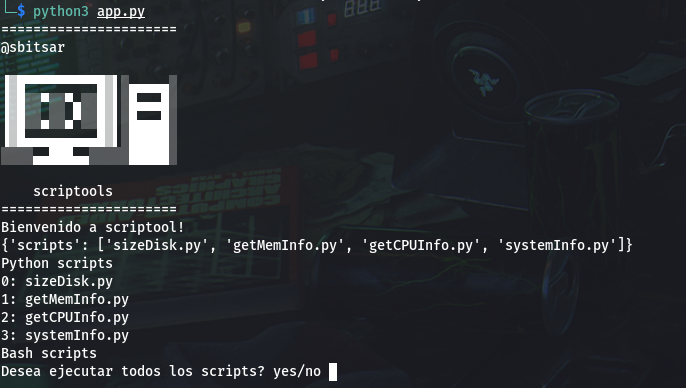

# ToolScript
Script para centralizar scripts y ejecutar desde un solo lugar.

## Tecnologias Usadas:
1. Python

## Componentes principales
1. Puede ejecutar todos los scripts uno tras otro de forma automatica.
2. Pude ejecutar scripts de auno elijiendo desde la lista del menu que podra tener de los scripts que se carguen.

## Img Demo

## Contacto
[LinkedIn - Benitez, Ricardo](www.linkedin.com/in/roseabdev)
